# Hello World — Flutter 🚀

> Proyek latihan Flutter untuk mata kuliah **Pemrograman Mobile** (Politeknik Negeri Malang).
> Disusun bertahap mengikuti codelab JTI Polinema: dari pembuatan repository,
> widget dasar, sampai **Material** & **Cupertino** widgets.

---

## ✨ Ringkasan Proyek
- **Platform**: Flutter (stable)
- **Bahasa**: Dart
- **Fokus**: Widget dasar, aset gambar, Material & Cupertino, dialog, input,
  FAB, serta Date/Time pickers.

---

## 📂 Struktur Proyek (ringkas)
```
lib/
 ├─ main.dart
 └─ basic_widget/
     ├─ text_widget.dart
     ├─ image_widget.dart
     ├─ fab_widget.dart
     ├─ loading_cupertino.dart
     ├─ scaffold_widget.dart
     ├─ dialog_widget.dart
     ├─ text_field_widget.dart
     └─ date_time_picker_widget.dart
assets/
 └─ logo_polinema.(png/jpg)
```

> Pastikan `pubspec.yaml` memuat aset berikut:
```yaml
flutter:
  uses-material-design: true
  assets:
    - assets/
```

---

## 🧭 Progress Development

### ✅ Praktikum 3 — Membuat Repository GitHub & Laporan
**Bagian apa**: Inisialisasi git, pembuatan repo GitHub, push proyek, dan penulisan README.  
**Singkatnya**:
- `git init`, tambah remote, commit & push.
- Menyusun **README.md** untuk dokumentasi dan bukti praktikum.
- Dan juga inisiasi **Nama Lengkap** untuk proyeknya.

  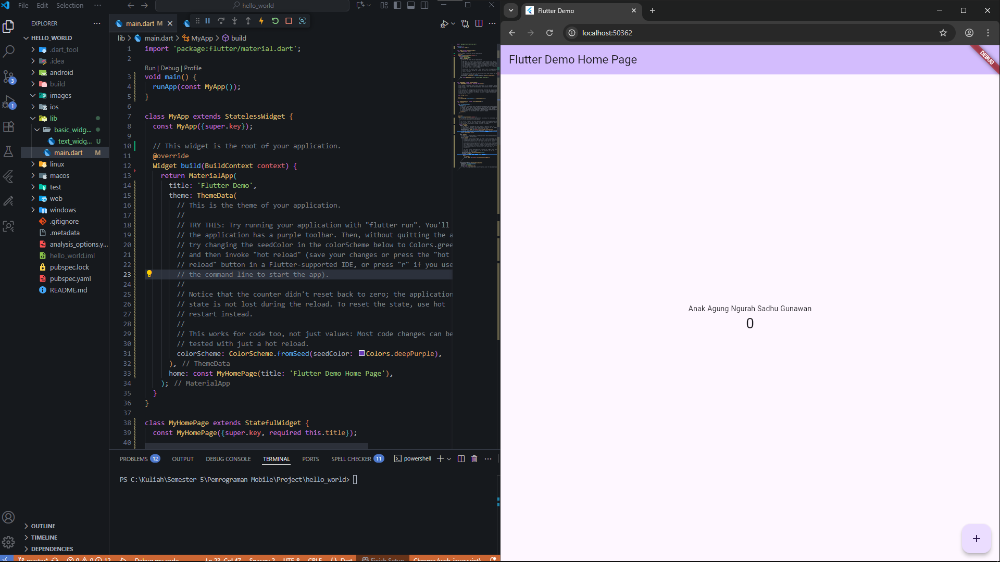

---

### ✅ Praktikum 4 — First App: Widget Dasar Flutter
**Bagian apa**: Pengenalan **StatelessWidget** & **StatefulWidget**, dan widget dasar.  
**Singkatnya**:
- `text_widget.dart` — menampilkan nama lengkap (widget teks kustom).

  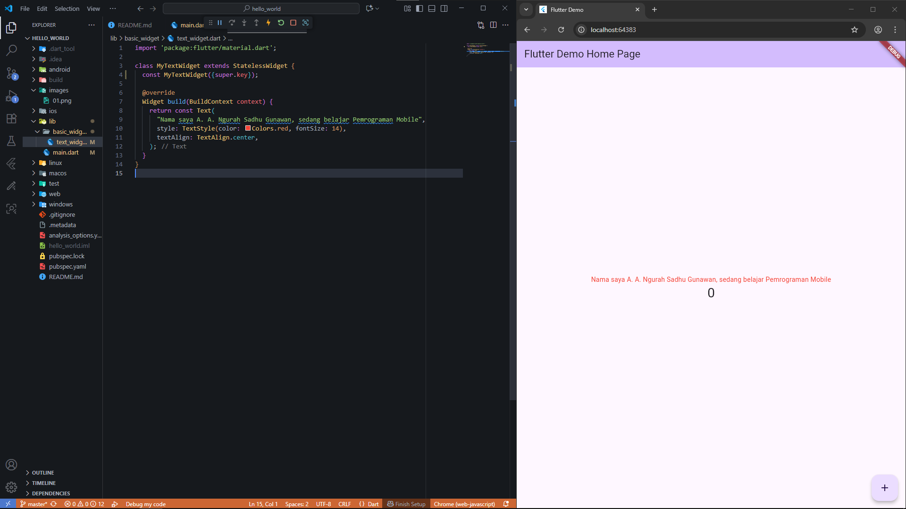

- `image_widget.dart` — menampilkan **logo Polinema** dari folder `assets/`.

  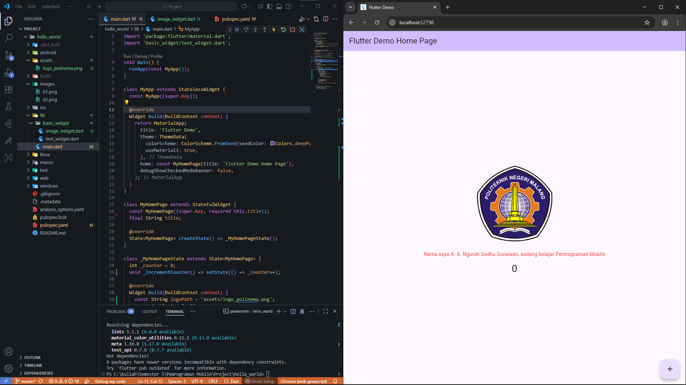

- Latihan **Row/Column/Container** & **Hot Reload**.
- Counter sederhana dengan `setState` (FAB menambah angka).

---

### ✅ Praktikum 5 — Menerapkan Widget Material Design & iOS Cupertino

#### Langkah 1 — Cupertino Button & Loading Bar
**Bagian apa**: `CupertinoButton` & `CupertinoActivityIndicator`.  
**Singkatnya**: Halaman iOS sederhana untuk membandingkan gaya Material vs Cupertino.  
**File**: `basic_widget/loading_cupertino.dart` (tanpa membungkus `MaterialApp`).

  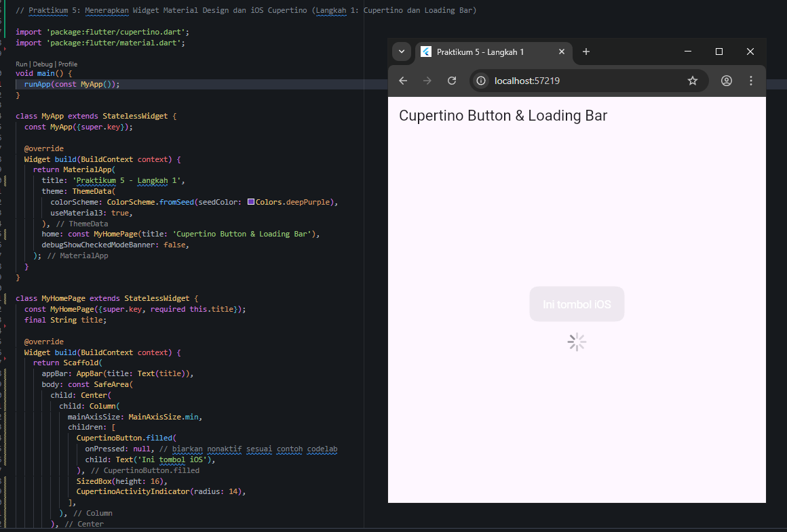

#### Langkah 2 — Floating Action Button (FAB)
**Bagian apa**: Tombol aksi melayang (FAB) untuk aksi cepat (increment counter).  
**Singkatnya**: Implementasi FAB standar + variasi (small/large/extended) dan posisi **centerDocked** dengan **notch**.  
**File**: `basic_widget/fab_widget.dart` (komponen FAB yang reusable).

  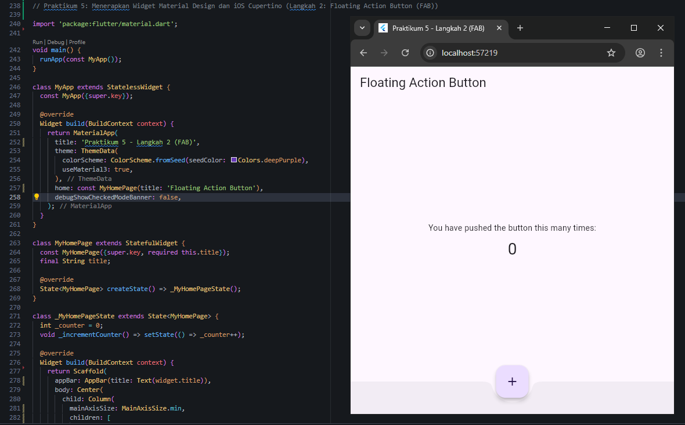

#### Langkah 3 — Scaffold Widget
**Bagian apa**: Kerangka halaman **Material**: `AppBar`, `body`, `BottomAppBar`, `floatingActionButton`.  
**Singkatnya**: Menyatukan layout app yang proper dan konsisten.  
**File**: `basic_widget/scaffold_widget.dart`.

  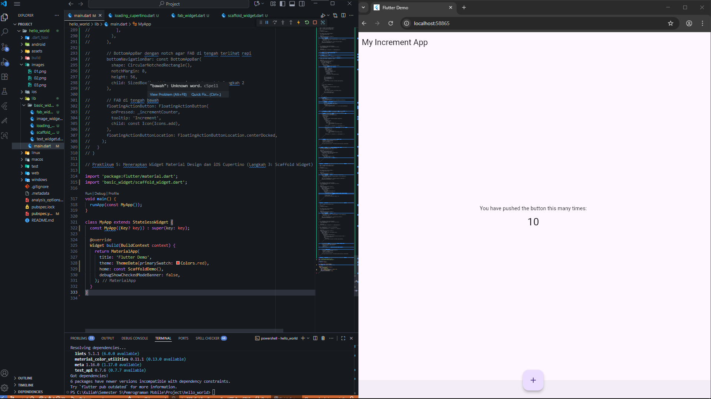

#### Langkah 4 — Dialog Widgets (AlertDialog & SimpleDialog)
**Bagian apa**: Dialog konfirmasi & pilihan sederhana.  
**Singkatnya**:
- **AlertDialog** dengan tombol OK (dismiss).
- **SimpleDialog** untuk memilih opsi (A/B), hasil ditampilkan via `SnackBar`.  
**File**: `basic_widget/dialog_widget.dart`.

  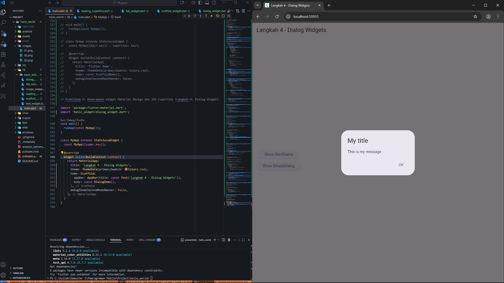

  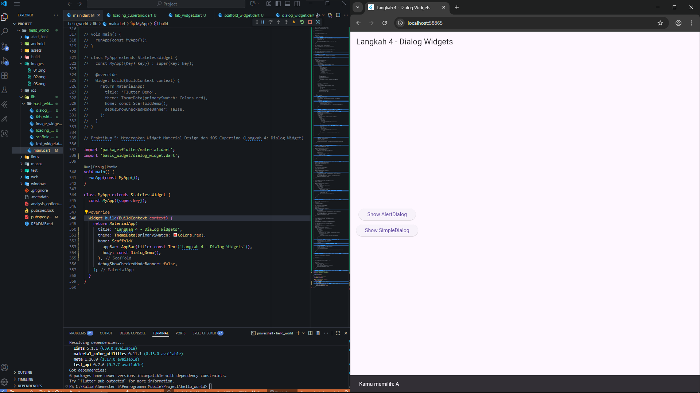

  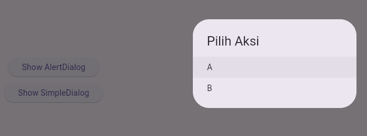

#### Langkah 5 — Input & Selection (TextField)
**Bagian apa**: Form input sederhana dengan **TextField** & `InputDecoration`.  
**Singkatnya**: Menangkap teks dengan tampilan Material (`OutlineInputBorder`, `labelText`).  
**File**: `basic_widget/text_field_widget.dart`.

  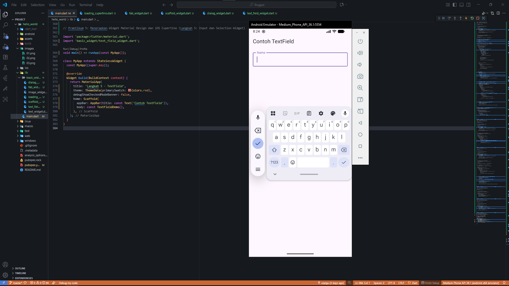

#### Langkah 6 — Date & Time Pickers
**Bagian apa**: `showDatePicker` & `showTimePicker`.  
**Singkatnya**: Memilih tanggal & waktu, menampilkan hasil terformat; tombol berada **di tengah**.  
**File**: `basic_widget/date_time_picker_widget.dart`.

  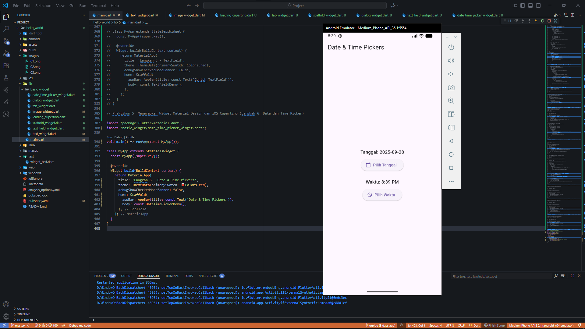

  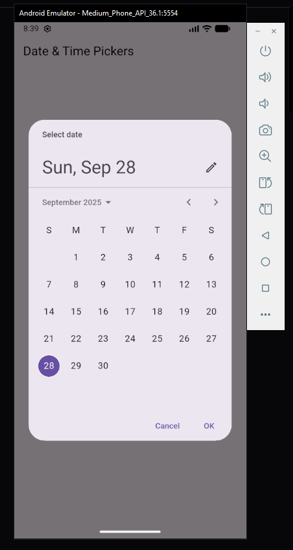

  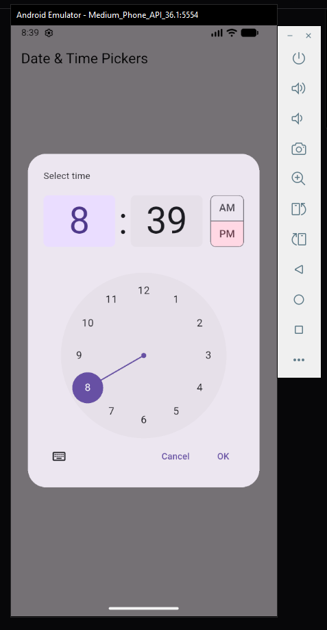

---

## ▶️ Menjalankan Proyek

### Via VS Code
1. **Pilih device** (Android Emulator / Chrome) di status bar.
2. **F5** (Start Debugging). Gunakan **Hot Reload** (Ctrl+S) & **Hot Restart** jika perlu.

### Via Terminal
```bash
flutter pub get
flutter run -d chrome      # atau emulator-5554, windows, macos, linux
```

> Jika aset gambar tidak tampil di Flutter Web, lakukan **hard refresh** (Ctrl+Shift+R)
> dan pastikan `assets/` terdaftar di `pubspec.yaml`.

---

## 🧩 Troubleshooting Singkat
- **Invalid constant value (Scaffold/AppBar)**: jangan beri `const` pada `Scaffold`/`AppBar`.
- **Unable to load asset**: cek `pubspec.yaml` (indentasi 2 spasi, path benar & case-sensitive) lalu `flutter clean` → `flutter pub get`.
- **FAB “nabrak” nav bawah**: gunakan `BottomAppBar` dengan `shape: CircularNotchedRectangle()` dan `centerDocked`.

---

## 📚 Referensi
- Codelab JTI Polinema — *Widget Dasar & Material/Cupertino*  
  https://jti-polinema.github.io/flutter-codelab/05-first-app-widget-dasar-flutter/

---

## 📝 Author
(2341760168) - A. A. Ngurah Sadhu Gunawan